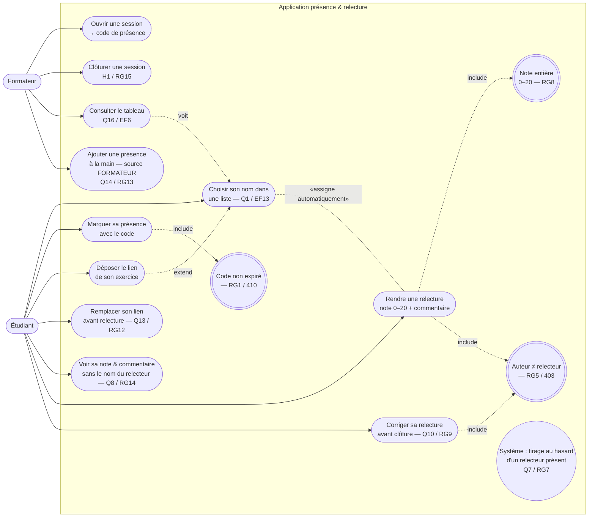

# D1 — Diagramme de cas d'utilisation

> Acteurs et ce que chacun peut faire. Le **relecteur** est un **étudiant dans un état donné**
> (cf. cahier §2) : il n'apparaît donc pas comme un acteur séparé mais comme un étudiant qui
> exécute une relecture **assignée**. Formalisme : Mermaid (versionné, diffable).

**Lecture / renvois :**
- `UC1 → UCPRES → UCDEP → UCREL → UCTAB` = le parcours nominal demandé (les 5 points du besoin).
- Les ellipses `((…))` sont des **règles de gestion incluses** (RG1, RG5, RG7, RG8) : un cas
  d'utilisation qui les ignore serait incomplet.
- `UCLISTE` (tirage aléatoire) est une fonction **système**, déclenchée par `UCDEP`, jamais par
  un clic humain : c'est ce qui garantit RG7 et rend l'écran relecteur possible.
- `UCADD` n'existe que pour le formateur (Q14) ; `UCCORR` est borné par la clôture (RG9/RG15).
