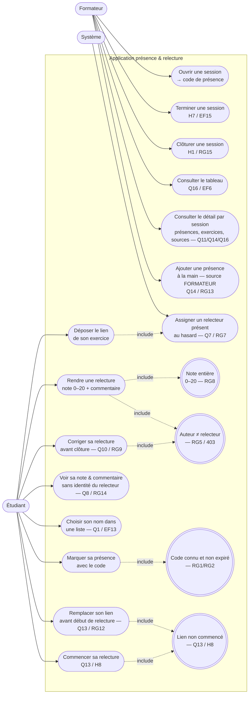

# D1 — Diagramme de cas d'utilisation

> Acteurs et ce que chacun peut faire. Le **relecteur** est un **étudiant dans un état donné**
> (cf. cahier §2) : il n'apparaît donc pas comme un acteur séparé mais comme un étudiant qui
> exécute une relecture **assignée**. Formalisme : Mermaid (versionné, diffable).

**Lecture / renvois :**
- `UC1 → UCPRES → UCDEP → UCASSIGN → UCREL → UCTAB` est le parcours nominal demandé.
- `UCLISTE` est uniquement la sélection d'identité ; `UCASSIGN` est la fonction système déclenchée
  par le dépôt et distincte de l'identité choisie.
- Les doubles parenthèses `((…))` sont des contraintes de gestion ; elles ne constituent pas des
  acteurs ni des extensions de cas d'utilisation.
- `UCFIN` et `UCCLOT` sont deux événements distincts (H7/H1). `UCREP` est bloqué dès `UCSTART`.
- `UCADD` n'existe que pour le formateur (Q14) ; `UCCORR` est borné par la clôture (RG9/RG15).
