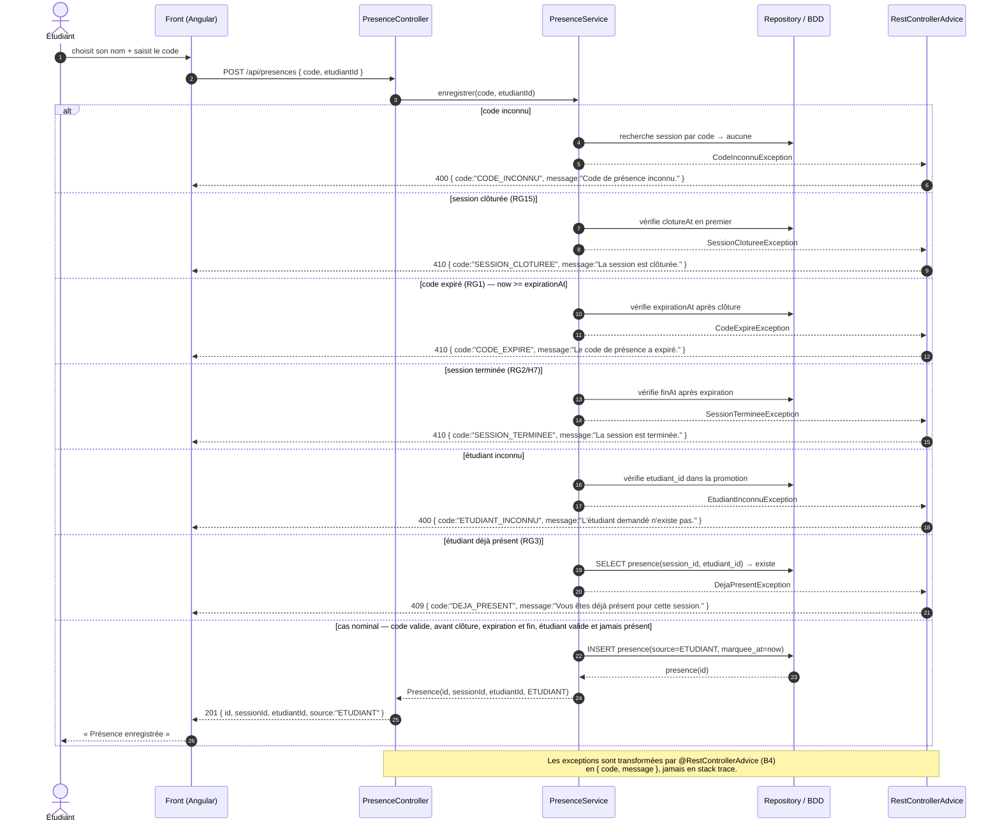

# D3 — Diagramme de séquence : « marquer sa présence »

> **Contrat de cohérence (barème : D3 ↔ codes HTTP du contrat).** Le cas nominal et les refus
> métiers utilisent exactement les statuts et le format d’erreur de `api/contrat.yaml` pour
> `POST /api/presences`. L’ordre implémenté est : code inconnu, clôture, expiration, fin, étudiant
> inconnu, doublon. Couche `@RestControllerAdvice` = point unique de production des erreurs (**B4**).

**Vérification de conformité au contrat (`POST /api/presences`) :**

| Situation du diagramme | Code HTTP | `code` d'erreur | Conforme annexe B ? |
|---|---|---|---|
| Nominal | `201` + `{id, sessionId, etudiantId, source}` | — | ✅ |
| Code inconnu | `400` | `CODE_INCONNU` | ✅ |
| Session clôturée | `410` | `SESSION_CLOTUREE` | ✅ |
| Code expiré (RG1) | `410` | `CODE_EXPIRE` | ✅ |
| Session terminée (RG2/H7) | `410` | `SESSION_TERMINEE` | ✅ |
| Étudiant inconnu | `400` | `ETUDIANT_INCONNU` | ✅ |
| Déjà présent (RG3) | `409` | `DEJA_PRESENT` | ✅ |

> La règle anti-devinte H5 conserve `400 TROP_ESSAIS` à partir de la cinquième saisie invalide ;
> elle n'est pas représentée ici pour laisser visibles les trois cas d'erreur explicitement exigés
> par le sujet.
