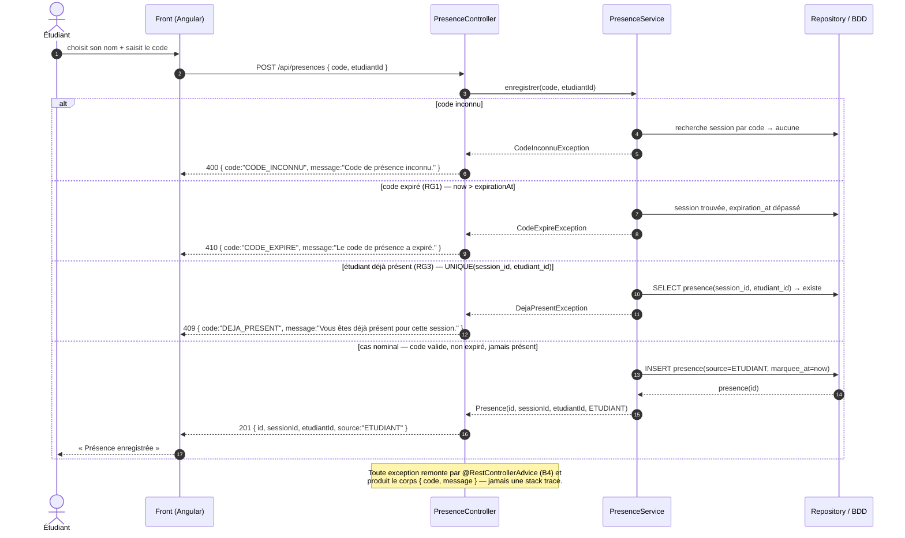

# D3 — Diagramme de séquence : « marquer sa présence »

> **Contrat de cohérence (barème : D3 ↔ codes HTTP du contrat).** Le cas nominal et **deux cas
> d'erreur** (code expiré, étudiant déjà présent) utilisent **exactement** les statuts et le format
> d'erreur de `api/contrat.yaml` pour `POST /api/presences` : `201` / `410 CODE_EXPIRE` /
> `409 DEJA_PRESENT` (et `400 CODE_INCONNU` en remarque). Couche `@RestControllerAdvice` = point
> unique de production des erreurs (**B4**).

**Vérification de conformité au contrat (`POST /api/presences`) :**

| Situation du diagramme | Code HTTP | `code` d'erreur | Conforme annexe B ? |
|---|---|---|---|
| Nominal | `201` + `{id, sessionId, etudiantId, source}` | — | ✅ |
| Code inconnu | `400` | `CODE_INCONNU` | ✅ |
| Code expiré (RG1) | `410` | `CODE_EXPIRE` | ✅ |
| Déjà présent (RG3) | `409` | `DEJA_PRESENT` | ✅ |

> Remarque (hors du champ de D3, traitée en EF12/RG4) : le 5ᵉ échec de saisie déclenche un
> `429 TROP_ESSAIS` (hypothèse **H5** du cahier) — non représenté ici pour ne pas masquer les
> trois cas exigés par le barème.
