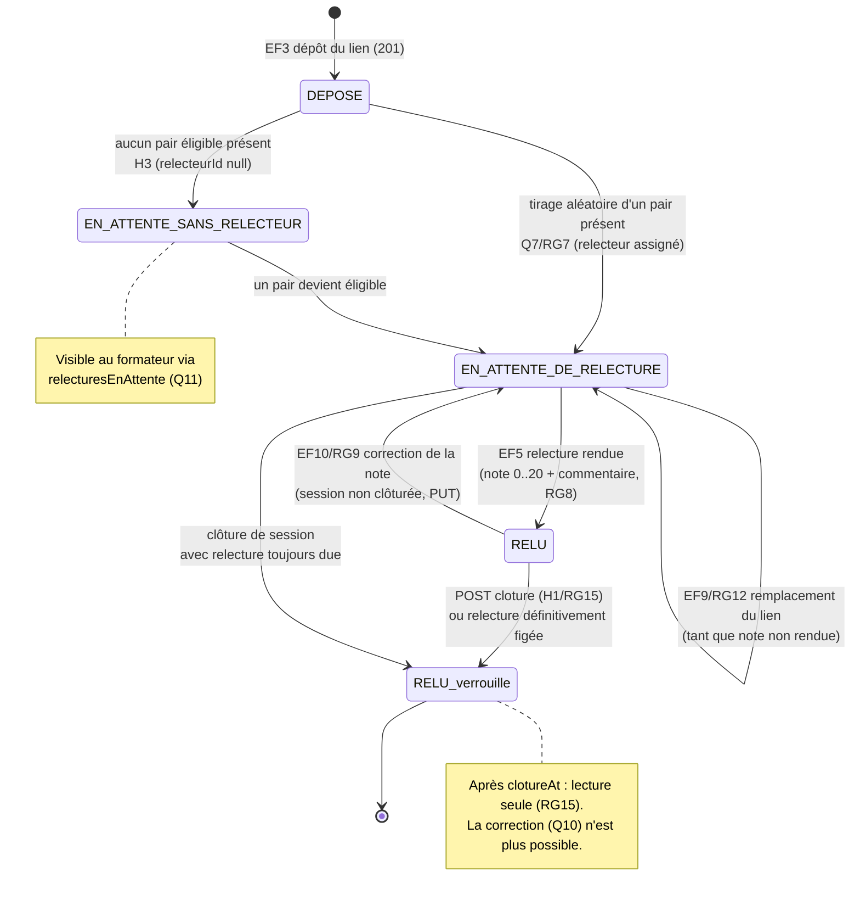

# D4 — Diagramme états-transitions : cycle de vie d'un exercice *(bonus +3)*

> Cycle de vie demandé par le sujet (déposé → en attente de relecture → relu), mis en cohérence
> avec `Exercice.statut` (D2) et les règles Q11 (en attente visible), Q13 (remplacement du lien),
> Q10/RG9 (correction avant clôture).

**Transitions ↔ exigences/règles :**

| Transition | Déclencheur | Réf |
|---|---|---|
| `[*] → DEPOSE` | `POST /api/exercices` (lien valide, non déjà déposé) | EF3 / RG16 |
| `DEPOSE → EN_ATTENTE_DE_RELECTURE` | assignation système d'un relecteur | EF4 / RG7 |
| `DEPOSE → EN_ATTENTE_SANS_RELECTEUR` | aucun pair présent ≠ auteur | H3 (trou repéré) |
| `EN_ATTENTE → EN_ATTENTE` (auto) | remplacement du lien avant notation | EF9 / RG12 |
| `EN_ATTENTE → RELU` | rendu de la note | EF5 / RG8 |
| `RELU → EN_ATTENTE` (retour) | correction avant clôture | EF10 / RG9 (arbitrage Q10) |
| `* → RELU_verrouille` | `POST /api/sessions/{id}/cloture` | EF11 / RG15 (trou H1) |

> Le statut rendu par `POST /api/exercices` (contrat : `{id, statut}`) vaut
> **`EN_ATTENTE_DE_RELECTURE`** dès qu'un relecteur est assigné, **`DEPOSE`** sinon — c'est le
> seul point de contact entre cette machine à états et le contrat imposé.
