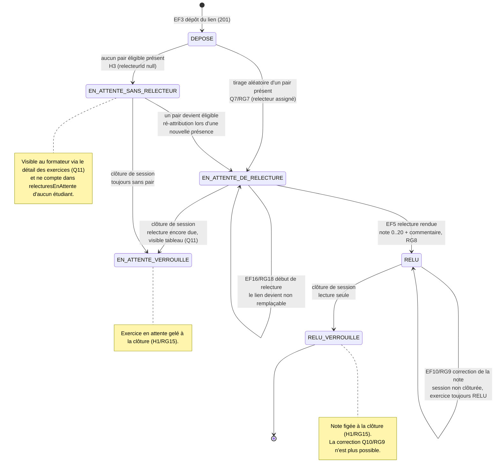

# D4 — Diagramme états-transitions : cycle de vie d'un exercice *(bonus +3)*

> Cycle de vie demandé par le sujet (déposé → en attente de relecture → relu), complété par les
> états sans relecteur et les états verrouillés par la clôture. Il est aligné avec `Exercice.statut`
> (D2), Q7/Q11 (affectation et attente), Q13 (début de relecture), Q10/RG9 (correction) et H1/H7
> (fin et clôture).

**Transitions ↔ exigences/règles :**

| Transition | Déclencheur | Réf |
|---|---|---|
| `[*] → DEPOSE` | `POST /api/exercices` (lien valide, non déjà déposé) | EF3 / RG16 |
| `DEPOSE → EN_ATTENTE_DE_RELECTURE` | assignation système d'un relecteur | EF4 / RG7 |
| `DEPOSE → EN_ATTENTE_SANS_RELECTEUR` | aucun pair présent ≠ auteur | H3 |
| `EN_ATTENTE_SANS_RELECTEUR → EN_ATTENTE_DE_RELECTURE` | nouvelle présence éligible et réévaluation des exercices sans relecteur | H3 / H9 |
| `EN_ATTENTE → EN_ATTENTE` | remplacement du lien avant `commenceeAt`, puis début de relecture | EF9 / EF16 / RG12 / RG18 |
| `EN_ATTENTE → RELU` | rendu de la note | EF5 / RG8 |
| `RELU → RELU` | correction avant clôture ; l'exercice ne repasse pas en attente | EF10 / RG9 / Q10 |
| `EN_ATTENTE → EN_ATTENTE_VERROUILLE` | clôture d'un exercice encore en attente | EF11 / RG15 / H1 |
| `RELU → RELU_VERROUILLE` | clôture d'un exercice relu | EF11 / RG15 / H1 |

> Le statut rendu par `POST /api/exercices` vaut `EN_ATTENTE_DE_RELECTURE` lorsqu'un pair est
> attribué, `EN_ATTENTE_SANS_RELECTEUR` sinon ; la clôture transforme les exercices encore en
> attente en `EN_ATTENTE_VERROUILLE` et les exercices relus en `RELU_VERROUILLE`. La fin seule
> (`finAt`) ne change pas le statut de l'exercice : elle bloque seulement l'auto-marquage.
